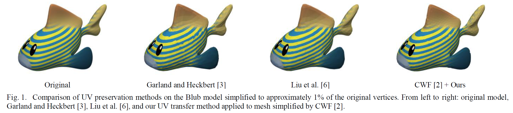

# Island-Preserving UV Transfer for Simplified Meshes

Implementation of the paper "Island-Preserving UV Transfer for Simplified Meshes" (MITA 2025).

## Overview

This project provides a post-processing method that transfers UV coordinates from original meshes to simplified meshes while preserving the UV island structure. It enables any geometric simplification method (e.g., QEM, CWF) to support textured models without modifying their core algorithms.


*Comparison of UV preservation methods on the Blub model simplified to ~1% vertices*

## Installation

### Requirements
- Python 3.7+
- NumPy
- SciPy
- Matplotlib
- Trimesh
- tqdm

### Setup
```bash
# Clone the repository
git clone https://github.com/yourusername/island-preserving-uv-transfer.git
cd island-preserving-uv-transfer

# Install dependencies
pip install -r requirements.txt
```

## Usage

### Basic Usage
```bash
python uv_transfer.py --original original.obj --simplified simplified.obj --output output.obj
```

### With Visualization
```bash
python uv_transfer.py --original original.obj --simplified simplified.obj --output output.obj --visualize
```

### Parameters
- `--original`: Path to the original mesh with UV coordinates
- `--simplified`: Path to the simplified mesh (without UVs)
- `--output`: Path for the output mesh with transferred UVs
- `--visualize`: Enable visualization of UV islands (optional)
- `--uv_threshold`: UV distance threshold for island detection (default: 0.01)

## Example

```bash
# Transfer UVs from original Spot model to CWF-simplified version
python uv_transfer.py \
    --original data/spot/spot_original.obj \
    --simplified data/spot/spot_cwf.obj \
    --output results/spot_with_uvs.obj \
    --visualize
```

## Method Overview

1. **UV Island Detection**: Identifies connected components in UV space using BFS
2. **Face Assignment**: Maps each simplified face to its nearest original island
3. **UV Interpolation**: Computes UV coordinates using barycentric interpolation within islands
4. **Island Reconstruction**: Rebuilds UV islands on the simplified mesh

## Results

Our method successfully transfers UV coordinates while:
- Preserving the original UV island structure
- Preventing cross-island interpolation artifacts
- Maintaining texture quality comparable to integrated methods

## Citation

If you use this code in your research, please cite:

```bibtex
@inproceedings{hwang2025island,
  title={Island-Preserving UV Transfer for Simplified Meshes},
  author={Hwang, Suil and Hong, Q Youn},
  booktitle={MITA 2025},
  year={2025}
}
```

## License

This project is licensed under the MIT License - see the [LICENSE](LICENSE) file for details.
